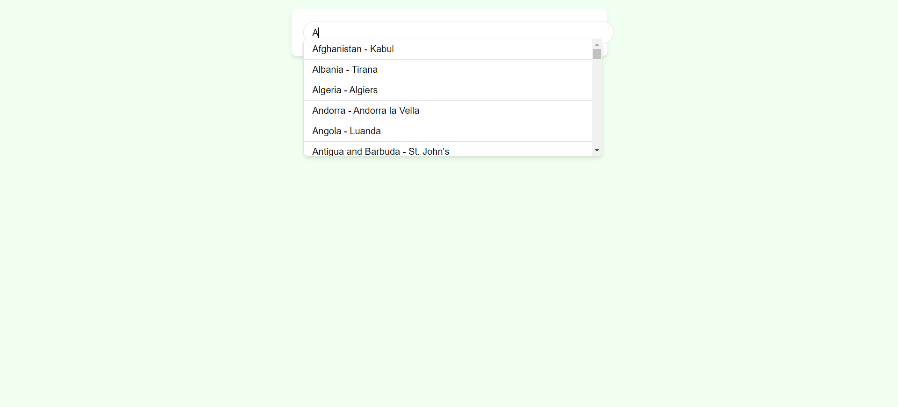

# Autocomplete

This is a simple autocomplete application built using HTML, CSS, and JavaScript. It allows users to search for countries and displays autocomplete suggestions as they type.

## Getting Started

To run the application locally, follow these steps:

1. Clone this repository to your local machine: `git clone https://github.com/TechnoPhasePRO/Autocomplete.git`.

2. Navigate to the project directory.

3. Install dependencies: `npm install`.

4. Start the server: `node server.js`.

5. Open your web browser and go to `http://localhost:3000` to view the application.

## Usage

- Type in the input box to search for countries. Autocomplete suggestions will appear as you type.
- Click on a suggestion to select it and populate the input box with the selected country.

## Screenshots

